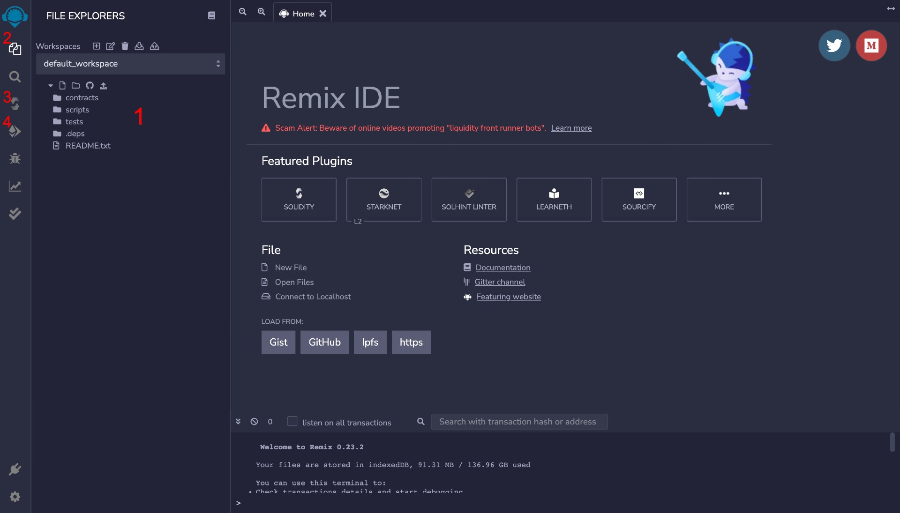
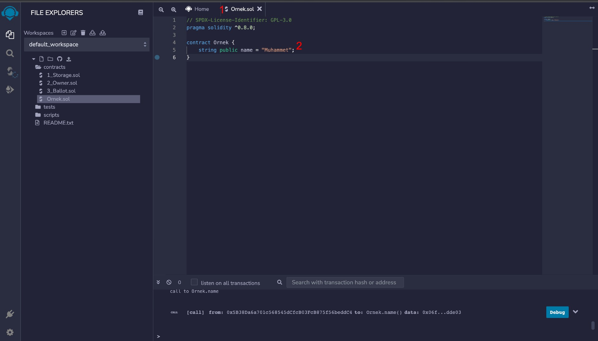
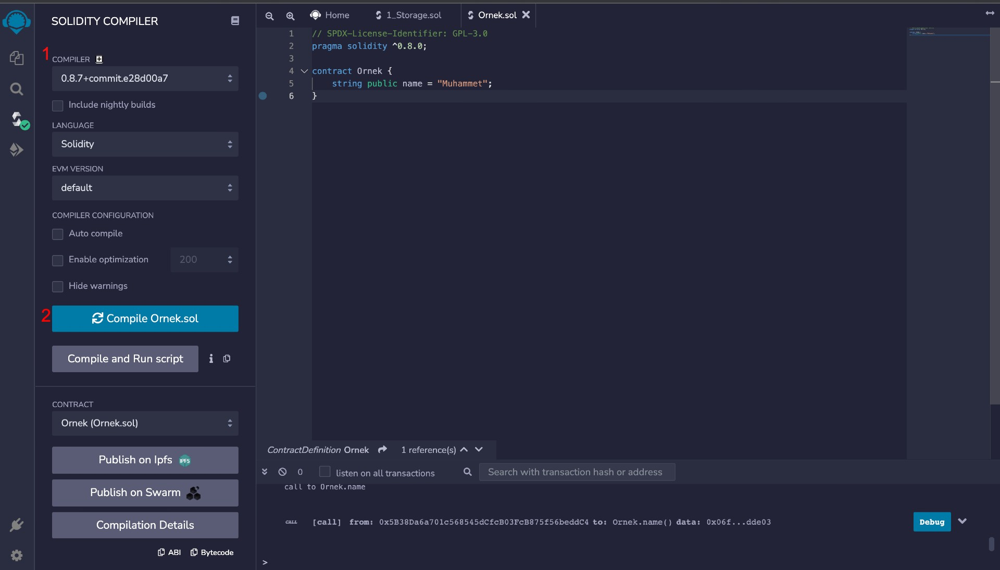
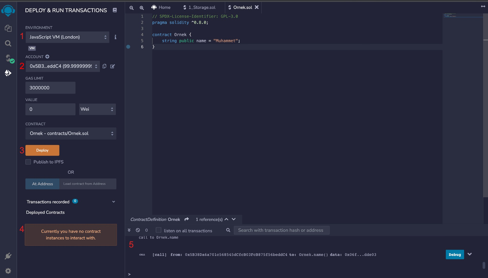
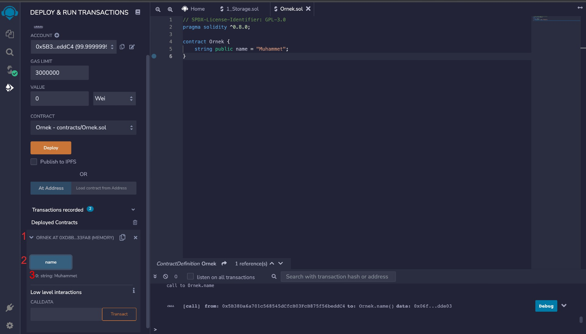

# İçerik

Bu belgede, solidity'ye dair derste işlenen genel bilgiler anlatılacaktır. Anlatılan kavramların özeti niteliğinde bir döküman olacaktır.

## Web3.0

Eğitime başlarken anlatılan ilk konu, Web2.0 ile Web3.0'ın kıyaslamasıydı. Web2.0'da bir uygulama backend servis olarak merkezi bir veya birden fazla sunucu ile etkileşime girerken, Web3.0'da bir blockchain ile etkileşime girer. Aradaki temel fark da budur. Web3.0'da bir blockchain ağıyla etkileşime girmek için yazdığımız programlara akıllı kontratlar diyoruz.

## Akıllı Kontratlar

Blockchain teknolojisinde sık kullanılan **akıllı kontrat** terimi, basitçe belirli şartlar sağlandığında gerçekleştirilen ve anonim taraflar (cüzdanlar aracılığı ile) güvenilirliği sağlayan bilgisayar programlarıdır. \
Diğer bir anlamıyla, blockchain'de bizim belirlediğimiz kurallara göre çalışacak olan koddur. En popüler ve büyük geliştirici kitlesine sahip olan akıllı kontrat dili [Solidity](docs.soliditylang.org)'dir. 


## Solidity

Solidity, [nesne tabanlı](https://en.wikipedia.org/wiki/Object-oriented_programming), [yüksek seviye](https://en.wikipedia.org/wiki/High-level_programming_language), [derlenen](https://en.wikipedia.org/wiki/Compiled_language) bir programlama dilidir.\
Solidity dosya uzantısı "**.sol**" dur.\
Solidity kodu'nun derleyicisi "**solc**" ve çalıştırma ortamı [Ethereum Virtual Machine](https://ethereum.org/en/developers/docs/evm/)'dir.

## Ethereum Virtual Machine ve ABI Kavramları

Bu konu teknik detay bir konu olduğu için pek üzerinde durulmamıştır. \
Kısaca yazılan Solidity kodları önce **.solc** ile derlenir ve ABI (Application Binary Interface) elde edilir. Daha sonra bu kod Ethereum Virtual Machine üzerinde çalıştırılır.
> **İlgililer için:** [What is an ABI and why is it needed to interact with contracts?](https://ethereum.stackexchange.com/a/235)

## Hardhat, Truffle

Bir akıllı kontrat geliştirirken ihtiyacımız olan ortamı (test, deploy vs.) bize sağlayan Environment'lardır.

## Remix IDE

Eğitim boyunca geliştirme yaptığımız ve tüm örnekleri test ettiğimiz ortam [Remix IDE](https://remix.ethereum.org/)'dir. Browser tabanlı bir editor olan Remix, aynı zamanda bize yazdığımız kontratları test edip istediğimiz yere deploy alabileceğimiz bir ortam sunduğu için akıllı kontrat geliştiricilerinin çoğu tarafından kullanılmaktadır.


* 1 - Burası bizim kaynak kod dosyalarımızın bulunduğu alandır. Contracts klasörü bizim yazdığımız akıllı kontrat dosyalarını saklayacağımız yerdir.
* 2 - Dosyaları gösteren editör sekmesidir.
* 3 - Derleyici sekmesidir. Buradan derleyici ayarları yapılabilir, istenilen .sol dosyası derlenir. Eğitim boyunca ***COMPILER CONFIGURATION > Auto Compile*** kısmını aktif ettik. Bu özellik, her değişiklikte otomatik derlenmesini sağlayacak.
* 4 - Deploy & Run sekmesidir. Derlenilen kodu istediğimiz bir ortama deploy alabileceğimiz ve bu deploy üzerinde istediğimiz transaction'ları gerçekleştirebilecemiz ayarlar bulunan sekmedir.
    * Not: Eğitimde, sekmenin en üstündeki environment kısmını değişmedik. Javascript VM, browser tabanlı bir izole blockchain ortamı sağlar. Dolayısıyla bu ortam bizim local'imizde olduğundan dolayı çok hızlı deploy alıp çok hızlı testlerimizi yapabildiğimiz için geliştirme ortamı olarak önerilen bir yoldur.


## Örnek Solidity Kodu

#### **`Ornek.sol`**
```solidity
// SPDX-License-Identifier: GPL-3.0
pragma solidity ^0.8.0;

contract Ornek {

}
```

Kodun ilk satırı lisans belirteci ve ikinci satırı da hangi solidity compiler versiyonunu kullanacağımızı belirtir.\
Eğitimde 0.8.0 versiyonu kullanılmıştır.

**Not:** Yorum satırı söz dizimi javascript gibi diller ile aynıdır. **//** ile tek satırlık yorum satırları yapılırken çoklu yorum satırı için **/\* -- \*/** kullanılmaktadır.

## Remix İlk Örnek

Burada remix ile ilk ve basit bir kontrat oluşturup onu deploy almayı görseller üzerinden anlatılacaktır. Deploy almak, yayına almak gibi düşünülebilir.

* İlk olarak Remix IDE'de dosyalar kısmında ***contracts*** klasörü içinde yeni bir dosya oluşturalım ve adını ***Ornek.sol*** yapalım.

    - 1 - Editörde o an hangi dosya üzerinde çalışacağımızı belirten sekmelerdir.
    - 2 - Burada kontratımız için bir değişken oluşturulmuştur. Bu konuları ileride göreceğiz. Bu yalnızca örnek olması açısından doldurulmuştur. Basitçe, **name** isminde bir değişken oluşturulmuş ve buna herkesin erişmesi için **public** olarak tanımlanmıştır.
* Daha sonra yazdığımız bu kodu en soldaki **compile** sekmesine gelip derleme aşamasına geçiyoruz.

    - 1 - Burada hangi solidity versiyonu ile derleyeceğimiz belirtilir. Eğitim süresince bu değer değiştirilmemiştir.
    - 2 - Tıklandığında ilgili kontrat dosyasını derler.
        - Üstündeki auto compile özelliği aktif edilirse kontratta yapılan her değişiklikten sonra kontrat derlenir. Eğitim boyunca bu özellik açık tutulmuştur.
* Şimdi, derlenilen kodu istediğimiz ortama deploy edebiliriz.

    - 1 - Deploy edeceğimiz ortamı belirtir. Eğitim boyunca, browser tabanlı izole bir blockchain sunan JavascriptVM (London) kullanılmıştır.
    - 2 - Remix, varsayılan olarak bize bazı oluşturulmuş cüzdanlar vermektedir. Burada bu deploy'u hangi cüzdanın yapacağı belirlenmektedir.
    - 3 - Deploy almak için tıklanacak butondur.
    - 4 - Daha önceden deploy alınmış kontratları belirtir.
    - 5 - Yapılan işlemleri ve sonuçları gösteren konsoldur. Deploy alındığında buradan başarılı veya başarısız durumu izlenebilir.
* Deploy aldığımız kontrat'a dair verileri artık görebiliriz.

    - 1 - Örnek isimli kontrat'ın belirli adreste deploy alınmış olduğunu belirtir.
    - 2 - Kontratta kullandığımız name isimli değişkeni belirtir. Daha fazla değişken, fonksiyon gibi yapı yazsaydık buradan erişebilirdik.
        - Not: buradan görebilmek için değişkenin erişim durumunun public olması gerekmektedir.
    - 3 - Değişkenin tipinin **string** ve değerinin kontratta belirttiğimiz değer olduğunu gösterir.